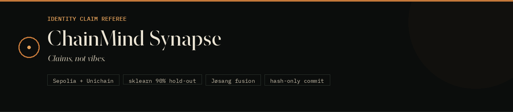
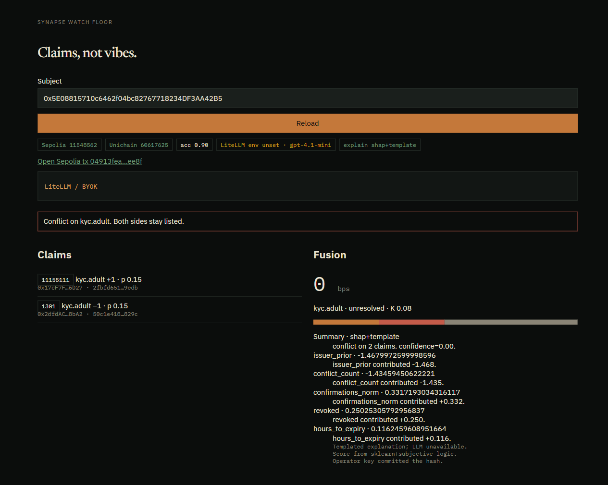

<p align="center">
  
</p>

<h1 align="center">ChainMind Synapse</h1>

<p align="center">
  <strong>A referee for identity claims that disagree across chains.</strong><br>
  Ingest live testnet events, score credibility with a frozen sklearn model,<br>
  fuse conflicts with Jøsang subjective logic, commit a hash-only verdict on Sepolia,<br>
  and serve it over REST in under 500&nbsp;ms.
</p>

<p align="center">
  <strong>Website:</strong>
  <a href="https://chainmind-synapse.vercel.app">https://chainmind-synapse.vercel.app</a><br>
  <strong>Demo video:</strong>
  <a href="https://drive.google.com/file/d/1ajDYbxxSzGHJGjbtK5GqPkTavMX4i_Ej/view">https://drive.google.com/file/d/1ajDYbxxSzGHJGjbtK5GqPkTavMX4i_Ej/view</a>
</p>

<p align="center">
  <a href="https://github.com/Raghavan2005/chainmind-synapse/actions/workflows/ci.yml"></a>
  
  
  
  
  <a href="https://chainmind-synapse.vercel.app"></a>
</p>

<p align="center">
  <a href="https://chainmind-synapse.vercel.app/#/0x5cCBd2Ef7DBC744AbFF179F5C5B8180B182B1221">Watch floor</a>
  ·
  <a href="https://drive.google.com/file/d/1ajDYbxxSzGHJGjbtK5GqPkTavMX4i_Ej/view">Demo video</a>
  ·
  <a href="https://fmngtnpp5e.us-east-1.awsapprunner.com/v1/health">API health</a>
  ·
  <a href="https://fmngtnpp5e.us-east-1.awsapprunner.com/v1/identity/0x5cCBd2Ef7DBC744AbFF179F5C5B8180B182B1221">Demo identity</a>
  ·
  <a href="instructions/INDEX.html">Spec</a>
</p>

---

<p align="center">
  
</p>

<p align="center"><em>Watch floor — conflict on <code>kyc.adult</code>. Both sides stay listed. Score is sklearn + fusion, not an LLM integer.</em></p>

## Why this exists

Users hold credentials on more than one chain. Those claims expire, get revoked, and sometimes contradict each other. A service on chain B cannot tell whether a claim from chain A is still true.

Existing products already score **wallet behavior** (Nomis, RubyScore), **social reputation** (Ethos), or **humanity / Sybil risk** (Trusta, Human Passport). DID/VC is a claim format. None of them reconcile **conflicting credential claims** into an explainable, tamper-evident verdict.

That remaining conjunction is the product.

| This project does | This project does not |
| --- | --- |
| Watch `ClaimPosted` / `ClaimRevoked` on two or more EVM testnets | Wrap Trusta, Nomis, or Human Passport |
| Score each claim with HistGradientBoosting | Let an LLM own `scoreBps` |
| Fuse belief / disbelief / uncertainty (Jøsang) | Hide the losing side of a conflict |
| Commit `keccak(preimage)` to Sepolia | Treat overlay JSON as source of truth |
| Explain with SHAP; optional LiteLLM prose | Fine-tune a judge model |
| Keep GET off the LLM hot path | Put PII or a hosted DB on the critical path |

## How it works

```
Holder / issuer wallets
        │  ClaimPosted / ClaimRevoked
        ▼
ClaimSource × N          Sepolia · Unichain · Base · OP · Ink · Mode · Minato
        │
        ▼
Ingest (web3.py)  →  normalize  →  score  →  fuse  →  explain (async)
        │                              │
        ▼                              ▼
IdentityState.commit              GET /v1/identity/{subject}
   (Sepolia, append-only)           last commit + memory overlay
```

1. **Post.** An issuer writes `(subject, topic, polarity, expiresAt, evidenceURI)` on a `ClaimSource`. Polarity is `+1` support or `−1` contradict for a named topic (`kyc.adult`, …).
2. **Watch.** Ingest decodes logs. Cursors are `(chainId, lastBlock)`. Restart is idempotent because `claimId` is deterministic.
3. **Normalize.** Instructor-over-LiteLLM maps messy evidence into a `NormalizedClaim`. No key? A rules parser still accepts the inline-JSON fixture.
4. **Score.** A frozen HistGradientBoosting model emits `pCredible` from issuer prior, expiry, revocation, conflict count, confirmations, and related features.
5. **Fuse.** Each score becomes a subjective-logic opinion `(b, d, u, a)`. Independent issuers fuse cumulatively; obvious duplicates average. High conflict `K` revises the weaker issuer and **refuses to hide** the disagreement.
6. **Commit.** `IdentityState` on Sepolia stores `stateHash`, `scoreBps`, and `modelVersion`. Anyone can re-run the open pipeline on the same logs and check the hash.
7. **Serve.** GET returns the overlay (flagged `pendingOnChain` if newer than the last mined commit) plus sources and scores. Explanation is built asynchronously — SHAP always, LiteLLM prose only if a key is present.

The operator key that is allowed to commit is a documented liveness concession, not a hidden identity provider. Integrity comes from the public preimage + hash, not from pretending the operator does not exist.

## Stack

| Layer | Choice | Why |
| --- | --- | --- |
| Claims + settlement | Solidity / Foundry on Sepolia + Superchain L2s | Two live sources; deploy scripts revert on mainnet ids `1` and `137` |
| Ingest | Python, web3.py | Idempotent log backfill, no hosted indexer |
| Credibility | scikit-learn HistGradientBoosting | PRD requires an existing ML library, not a fine-tune |
| Fusion | Pure Python Jøsang operators | `p = 0.5` is either ignorance or conflict; uncertainty mass `u` tells them apart |
| Attribution | SHAP TreeExplainer | Named features in the explanation, not generic filler |
| Prose | Instructor + LiteLLM, optional | Clerk, not oracle. GET never waits on it |
| API | FastAPI | `/v1/health`, identity, history, explain, replay |
| Dashboard | Vite + React | Watch floor at [chainmind-synapse.vercel.app](https://chainmind-synapse.vercel.app) |
| Spec | HTML in [`instructions/`](instructions/INDEX.html) | Living dossier. `AGENTS.md` / `CLAUDE.md` only point there |

**FR-01 pair:** Ethereum Sepolia (`11155111`) + Unichain Sepolia (`1301`). The PRD named Goerli and Mumbai; both were sunset in April 2024. Extra watched sources (same-day SepETH via each L2’s own `L1StandardBridge`): Base, OP, Ink, Mode, Soneium Minato.

## Model

Held-out metrics from `data/metrics.json` (720 train / 180 test rows):

| Metric | Value |
| --- | --- |
| Accuracy | **0.90** (gate: > 0.75) |
| F1 | 0.911 |
| Brier | 0.087 |
| Revoked + expired fixture `p` | 0.078 |

Features: `issuer_prior`, `issuer_volume`, `hours_to_expiry`, `expired`, `revoked`, `claim_age_hours`, `confirmations_norm`, `signature_valid`, `conflict_count`, `chain_is_settlement`, `polarity`, `evidence_len_norm`.

## Live demo

Canonical UI: [chainmind-synapse.vercel.app](https://chainmind-synapse.vercel.app/#/0x5cCBd2Ef7DBC744AbFF179F5C5B8180B182B1221)  
Demo video: [FInal2.mp4 on Google Drive](https://drive.google.com/file/d/1ajDYbxxSzGHJGjbtK5GqPkTavMX4i_Ej/view)  
Read API: [fmngtnpp5e.us-east-1.awsapprunner.com/v1/health](https://fmngtnpp5e.us-east-1.awsapprunner.com/v1/health)

Demo subject `0x5cCBd2Ef7DBC744AbFF179F5C5B8180B182B1221`:

| Step | Chain | Link |
| --- | --- | --- |
| Claim A `kyc.adult` +1 | Sepolia | [`0x258a839c…`](https://sepolia.etherscan.io/tx/0x258a839cc148b352ce1bc581dea792ae58c34b46748f95cda2d37371347a8d94) |
| Claim B `kyc.adult` −1 | Unichain Sepolia | [`0x55e1f73e…`](https://sepolia.uniscan.xyz/tx/0x55e1f73e55556412280bf7844a4ec0a0cdf0d23776b8e7e5b05529b24106a197) |
| Conflict `StateCommitted` | Sepolia | [`0x654ddce8…`](https://sepolia.etherscan.io/tx/0x654ddce8b47cba6b06fe9508ece0ffaf7b9aeb67d59f046bf2fcedad7bee4135) |

Decoded `StateCommitted` from that receipt (via `process_receipt`, not a mocked value):

```
commitId     0x815db98f00448421fd6eea71ebff671448e7e9a1a74466b87f49d8fe49e0c338
stateHash    0xdb2acacfa434d7e66ab913b57d1f9fd58c7810b52274c57cc291b59642cc8789
scoreBps     0
modelVersion 0x3fd4e29b2b3f0f7a1cf9b9ab687c041885cfd4c19acde734495dfd99d005c1d1
issuedAt     1787466048
```

```bash
curl -s https://fmngtnpp5e.us-east-1.awsapprunner.com/v1/identity/0x5cCBd2Ef7DBC744AbFF179F5C5B8180B182B1221
```

## Contracts (2026-08-23 throwaway deploy)

| Contract | Chain | Address |
| --- | --- | --- |
| ClaimSource | Sepolia | [`0x16366eae…0614`](https://sepolia.etherscan.io/address/0x16366eaeEddB90C990704ee6d12C43B30D9CF614) |
| ClaimSource | Unichain Sepolia | [`0x5c2749F6…2c59`](https://sepolia.uniscan.xyz/address/0x5c2749F63fC6f50C600DA04f0Fd87bF8299c2c59) |
| ClaimSource | Base / OP / Ink / Mode / Minato | [`0x5c2749F6…2c59`](https://sepolia.basescan.org/address/0x5c2749F63fC6f50C600DA04f0Fd87bF8299c2c59) (same CREATE address — deployer nonce 0 on each L2) |
| IdentityState | Sepolia | [`0xE11CD3Bb…4894`](https://sepolia.etherscan.io/address/0xE11CD3Bb815ED4CA95692907ABa6fB3180F84894) |

Gas path: Sepolia → each L2 via **that L2’s own** L1StandardBridge (`scripts/bridge_sepolia_to_l2.sh`). Never mainnet Unichain / Base / OP bridges (`0x81014F44…` / `0x3154Cf16…` / `0x99C9fc46…`).

## API

| Method | Path | Notes |
| --- | --- | --- |
| `GET` | `/v1/health` | Heads, accuracy, contracts, RPC errors, public LLM flags |
| `GET` | `/v1/identity/{subject}` | Fused state + sources + scores |
| `GET` | `/v1/identity/{subject}/history` | On-chain commit ids |
| `GET` | `/v1/identity/{subject}/explanation` | 404 until cached |
| `POST` | `/v1/identity/{subject}/explain` | Regenerate (optional browser BYOK). Does not rewrite chain state |
| `GET` | `/v1/llm` | Public LiteLLM status — never includes `apiKey` |
| `POST` | `/v1/llm/test` | Connection probe |
| `POST` | `/v1/replay/{subject}` | Bearer `REPLAY_BEARER` — rebuild overlay from logs |

Interactive docs when running locally: `http://127.0.0.1:8000/docs`.

## Repository

```
contracts/          ClaimSource + IdentityState (Foundry)
services/           ingest → normalize → score → fuse → explain → API
dashboard/          Vite watch floor (Vercel)
instructions/       Living HTML spec — start at INDEX.html
scripts/            demo_flow, L2 bridge, AWS / Vercel preflight
data/               frozen model + metrics (overlay is a cache, gitignored)
assets/             README / social images
```

The constitution is [`instructions/CLAUDE.html`](instructions/CLAUDE.html). Architecture, math, schemas, and the 6-hour plan live beside it. Do not recreate that dossier as a second Markdown tree.

## Quick start

Requires Python 3.12, [Foundry](https://book.getfoundry.sh/getting-started/installation), and (for the dashboard) Node 20+.

```bash
python3.12 -m venv .venv && source .venv/bin/activate
pip install -r requirements.txt
cd contracts && forge install foundry-rs/forge-std OpenZeppelin/openzeppelin-contracts@v5.4.0 --no-git --shallow && forge test -vv && cd ..
python -m services.score.train
cp .env.example .env          # addresses are filled; paste keys from a teammate, never from git
# fund Sepolia ETH, then: bash scripts/bridge_sepolia_to_l2.sh <unichain|base|op|ink|mode|soneium>
uvicorn services.api.main:app --host 0.0.0.0 --port 8000
```

In another terminal:

```bash
python -m services.ingest.watch
bash scripts/demo_flow.sh
```

Dashboard:

```bash
cd dashboard && npm install && npm run dev
```

Same image locally: `docker compose up --build`. Ingest and API share `data/overlay.json`. No hosted database is the source of truth.

### Tests

```bash
forge test -vv                          # contracts: post, revoke, idempotent commit
pytest                                  # fusion math, schema, API (no secrets in LLM payloads)
python -m services.score.train          # writes data/model.joblib + data/metrics.json
```

### Deploy

Deploy scripts revert on chain id `1` and `137`.

```bash
cd contracts
forge script script/DeployClaimSource.s.sol:DeployClaimSource --rpc-url $SEPOLIA_RPC_URL --broadcast --private-key $DEPLOYER_PRIVATE_KEY
forge script script/DeployClaimSource.s.sol:DeployClaimSource --rpc-url $UNICHAIN_SEPOLIA_RPC_URL --broadcast --private-key $DEPLOYER_PRIVATE_KEY
# extra L2s after SepETH credit: bash ../scripts/deploy_extra_l2s.sh
forge script script/DeployIdentityState.s.sol:DeployIdentityState --rpc-url $SEPOLIA_RPC_URL --broadcast --private-key $DEPLOYER_PRIVATE_KEY
```

Paste addresses into `.env`. Public RPCs and L1 bridges are in `.env.example`.

## Hosting

Spec: [`instructions/DEVOPS.html`](instructions/DEVOPS.html).

| Surface | Where |
| --- | --- |
| Dashboard | Vercel Hobby — [chainmind-synapse.vercel.app](https://chainmind-synapse.vercel.app) (canonical). A second Hobby alias is CORS-allowed but is not the product URL. |
| API + ingest | AWS App Runner (no operator key) or laptop / Compose |
| Image | ECR `us-east-1`, pushed by GitHub Actions after CI |
| Ledger | Sepolia `IdentityState`. Overlay JSON is a cache |

CI (Foundry, pytest + train, dashboard build, Docker) always runs. AWS and Vercel deploys from Actions stay behind repository variables (`AWS_DEPLOY_ENABLED`, `VERCEL_DEPLOY_ENABLED`). No Secrets Manager, no RDS, no writer key on AWS.

```bash
bash scripts/aws_preflight.sh --create    # us-east-1 unless AWS_REGION is set
# later: bash scripts/aws_preflight.sh --teardown
cd dashboard && vercel link --yes --project chainmind-synapse && vercel --prod --yes
```

## Operators

If Unichain Sepolia itself goes down (both RPC and fallback), `bash scripts/emergency_anvil_source.sh` stands up a local Anvil `ClaimSource`. Ingest and `/v1/health` pick it up on the next poll (`health.emergencySource`). It is never auto-started and never silently presented as real Unichain data.

Workspace agents (`chainwright`, `brainwright`, `apowright`, `facewright`) live under `.compozy/agents/`. The spec stays in `instructions/*.html`.

## What we will not over-claim

- The operator key is real. It is said out loud.
- `stateHash` is a commitment, not a zk proof of honest scoring.
- Labels are synthetic. Two EVM testnets are not every chain.
- We do not de-anonymize people, replace legal identity, or put government-ID images on-chain.
- Explanation prose is optional. The number comes from sklearn + fusion.

Full decision table: [`instructions/PROPOSAL.html`](instructions/PROPOSAL.html) and [`instructions/ARCHITECTURE.html`](instructions/ARCHITECTURE.html).

## License

MIT. See [LICENSE](LICENSE).
