# Execution Flow & Module Architecture (document.md)

This document maps how execution travels between files, modules, and functions in **ChainMind Synapse**, detailing the lifecycle of data from initial ingestion to consensus calculation, visual rendering, and state commitment.

---

## 1. File & Module Structure

```text
problemStatement/
├── index.html          # Semantic HTML5 3-Column Watch Floor Layout & Simplex View
├── index.css           # Institutional Neutral Design System & CSS Custom Properties
├── js/
│   ├── app.js          # Main Application Controller & Event Orchestrator
│   ├── ai-engine.js    # Subjective Logic Math, Cumulative Fusion, & SHAP Explainer
│   ├── state.js        # State Store, Normalized Claim Schemas, & Scenario Feeds
│   └── canvas.js       # HTML5 Canvas 2D Dynamic Visualizer (Simplex & Particle Topology)
├── instructions/       # Normative Constitution & Specifications (DESIGN, MATH, SCHEMA, CLAUDE)
├── decision.md         # Engineering & Design Decisions Log
└── document.md         # Runtime Execution Flow Map
```

---

## 2. End-to-End Execution Flow

```mermaid
sequenceDiagram
    autonumber
    actor User as Operator / Browser
    participant App as js/app.js (WatchFloorApp)
    participant State as js/state.js (StateStore)
    participant Engine as js/ai-engine.js (SubjectiveLogicEngine)
    participant Canvas as js/canvas.js (SynapseCanvas)
    participant DOM as index.html (DOM Elements)

    User->>App: DOMContentLoaded
    App->>State: new StateStore()
    App->>Engine: new SubjectiveLogicEngine()
    App->>Canvas: new SynapseCanvas(synapseEl, simplexEl)
    App->>State: subscribe(renderUI)
    
    rect rgb(20, 25, 35)
        Note over App,DOM: Initial Evaluation & Render
        App->>Engine: evaluateSubject(claims)
        Engine->>Engine: mapEvidenceToBetaOpinion(claim)
        Engine->>Engine: fuseOpinionsCumulative(opinions)
        Engine->>Engine: computeConflictPenalty(opinions)
        Engine->>Engine: generateShapReasons(features)
        Engine-->>App: Return { verdict, confidence, scoreBps, fusedOpinion, conflictK, reasons }
        App->>Canvas: loadState(claims, fusedOpinion)
        Canvas->>Canvas: Start 60 FPS requestAnimationFrame Loop
        App->>DOM: Update Confidence (scoreBps), Stacked Bar (b/d/u), Claims List, SHAP Items
    end

    rect rgb(25, 30, 45)
        Note over User,DOM: Scenario Switch / Interaction
        User->>DOM: Click Scenario Pill ("Conflict on kyc.adult")
        DOM->>State: loadScenario('revocation-conflict')
        State->>State: Update active claims & recalculate stateHash
        State-->>App: notify(subscribers)
        App->>Engine: evaluateSubject(newClaims)
        App->>Canvas: loadState(newClaims, newOpinion)
        App->>DOM: Re-render UI Elements & Simplex Point
    end
```



---

## 3. Detailed Function-by-Function Flow

### 1. Ingestion & Normalization (`js/state.js`)
- `StateStore.constructor()`: Initializes default scenario (`revocation-conflict`), subject DID (`did:ethr:sepolia:0x742d...`), model version (`1.0.0`), and state hashes.
- `StateStore.loadScenario(scenarioKey)`: Loads normalized claims matching `SCHEMA.html` with fields:
  - `claimId`: Unique hash `0x...`
  - `chainId`: Sepolia (`11155111`) or Amoy (`80002`)
  - `topic`: `kyc.adult`, `residency.eu`, `credit.score`
  - `polarity`: `+1` (affirm) or `-1` (deny)
  - `pCredible`: ML-predicted credibility float $[0, 1]$
  - `opinion`: Beta opinion $(b, d, u, a)$

### 2. Subjective Logic Evaluation (`js/ai-engine.js`)
- `SubjectiveLogicEngine.evaluateSubject(claims)`: Main entry point for consensus.
  1. Filters active claims (excludes expired TTL or revoked claims).
  2. Maps evidence to Beta opinions:
     $$b = \frac{r}{r+s+W}, \quad d = \frac{s}{r+s+W}, \quad u = \frac{W}{r+s+W} \quad (W=2, a_0=0.5)$$
  3. Fuses multiple opinions using Jøsang Cumulative Fusion ($\oplus$):
     $$b_{A\oplus B} = \frac{b_A u_B + b_B u_A}{u_A + u_B - u_A u_B}, \quad u_{A\oplus B} = \frac{u_A u_B}{u_A + u_B - u_A u_B}$$
  4. Calculates pairwise conflict mass $K_{ij} = b_i d_j + d_i b_j$ and global conflict penalty $\bar{K}$.
  5. Computes overall confidence score:
     $$C = (1 - u_\tau) \cdot (1 - \bar{K}) \cdot \text{clip}(2|P - 0.5|, 0, 1)^{0.5}, \quad \text{scoreBps} = \text{round}(10000 \cdot C)$$
  6. Generates SHAP attribution explanations for the UI.

### 3. Dynamic Visualizer & Ternary Projection (`js/canvas.js`)
- `SynapseCanvas.updatePhysics()`: Orbiting node trajectories, spring recovery physics, and photon propagation.
- `SynapseCanvas.draw()`:
  - Renders concentric titanium radar grids.
  - Draws quadratic bezier synaptic links from multi-chain emitters to the central AI Core.
  - Draws continuous 60 FPS white photon streams.
- `SynapseCanvas.drawSimplex()`:
  - Translates $(b, d, u)$ into 2D barycentric canvas coordinates:
    $$P = b \cdot P_{\text{Right}} + d \cdot P_{\text{Left}} + u \cdot P_{\text{Top}}$$
  - Plots the active opinion coordinate pointer and trajectory tracer.

### 4. UI & Modal Controller (`js/app.js`)
- `WatchFloorApp.renderUI()`: Updates rail metadata, conflict alert box, claims list, large basis point score (`val-score-bps`), stacked bar, and SHAP list.
- `WatchFloorApp.renderApiModalContent()`: Generates raw JSON output matching `GET /v1/identity/{subject}` specification in `instructions/SCHEMA.html`.
- `WatchFloorApp.renderPreimageModalContent()`: Produces cryptographic preimage JSON matching `verify_hash.py`.
