# System Execution Map (document.md)

This document shows **how data travels** through the files, functions, and modules in **ChainMind Synapse**. It is written in simple, plain English to show the exact order of operations when the app starts up or when a user clicks a button.

---

## 1. The Cast of Files (Who Does What?)

```text
problemStatement/
├── index.html        ──► The Blueprint: Defines the 3 columns, buttons, and canvas boxes on the webpage.
├── index.css         ──► The Stylist: Sets the institutional slate colors, fonts, and dark theme.
├── js/
│   ├── app.js        ──► The Conductor: Connects button clicks to state changes and DOM updates.
│   ├── state.js      ──► The Memory Store: Holds the active identity claims and pre-set test scenarios.
│   ├── ai-engine.js  ──► The Math Brain: Computes Belief, Disbelief, Conflict, and Confidence scores.
│   └── canvas.js     ──► The Visualizer: Animates the glowing multi-chain particles and the 2D Simplex triangle.
├── decision.md       ──► The Architecture Log: Explains why every technical decision was made.
└── document.md       ──► This Execution Map: Explains how data flows step-by-step.
```

---

## 2. Step-by-Step Execution Flow

### Phase A: App Startup (When you open the page)

```mermaid
sequenceDiagram
    autonumber
    actor User as User Browser
    participant HTML as index.html
    participant App as js/app.js (WatchFloorApp)
    participant State as js/state.js (StateStore)
    participant Brain as js/ai-engine.js (SubjectiveLogicEngine)
    participant Canvas as js/canvas.js (SynapseCanvas)

    User->>HTML: Opens http://localhost:3000
    HTML->>App: Runs constructor() when DOM is ready
    App->>State: new StateStore() (Loads default scenario: "Conflict on kyc.adult")
    App->>Brain: new SubjectiveLogicEngine() (Initializes math formulas)
    App->>Canvas: new SynapseCanvas() (Finds the 2 canvas elements)
    App->>State: Subscribes renderUI() to listen for state changes
    
    rect rgb(20, 25, 35)
        Note over App,Canvas: First Calculation & Render
        App->>Brain: evaluateSubject(claims)
        Brain->>Brain: 1. Maps claims to Beta opinions (b, d, u)
        Brain->>Brain: 2. Combines opinions using Cumulative Fusion
        Brain->>Brain: 3. Calculates Conflict Penalty (K)
        Brain->>Brain: 4. Computes Confidence Score (scoreBps)
        Brain-->>App: Returns final results { scoreBps, fusedOpinion, conflicts, reasons }
        App->>Canvas: loadState(claims, fusedOpinion)
        Canvas->>Canvas: Starts 60 FPS animation loop for particles and simplex pointer
        App->>HTML: Writes score ("4100 bps"), stacked bar, and claim list to screen
    end
```



---

### Phase B: User Interaction (When you click a scenario button)

1. **User Action**: The user clicks the **"Clean Multi-Chain Sync"** pill button on the page.
2. **`js/app.js` captures the click**:
   - The button's event listener calls `this.state.loadScenario('clean')`.
3. **`js/state.js` updates memory**:
   - Replaces the conflicting claims with two unanimous positive claims (both affirming `kyc.adult = +1`).
   - Calls `this.notify()`, which alerts all subscribed components that data changed.
4. **`js/ai-engine.js` runs new calculations**:
   - Receives the clean claims with zero conflict.
   - Calculates high Belief ($b = 0.88$), low Disbelief ($d = 0.00$), and low Uncertainty ($u = 0.12$).
   - Calculates a high confidence score of `8800 bps` ($0.88$).
5. **`js/canvas.js` animates the visual update**:
   - Changes node particles to clean emerald/white streams.
   - Smoothly moves the 2D Simplex coordinate pointer to the bottom-right vertex ($b = 1.0$).
6. **`index.html` DOM updates**:
   - The large score text changes from `4100 bps` $\to$ `8800 bps`.
   - The verdict badge changes from `CONFLICT` $\to$ `SUPPORTED`.
   - The conflict alert banner disappears.

---

## 3. Data Transformations Along the Path

| Step | Data Form | Handled By | Example Output |
|---|---|---|---|
| **1. Raw Claim** | Blockchain Event | `js/state.js` | `{ chainId: 11155111, topic: 'kyc.adult', polarity: +1, pCredible: 0.92 }` |
| **2. Opinion Vector** | Beta Mapping $(\omega)$ | `js/ai-engine.js` | `{ b: 0.82, d: 0.00, u: 0.18, a: 0.50 }` |
| **3. Fused Consensus** | Cumulative Fusion $(\oplus)$ | `js/ai-engine.js` | `{ b: 0.88, d: 0.00, u: 0.12 }` |
| **4. Final Confidence** | Basis Points Formula | `js/ai-engine.js` | `scoreBps = 8800` ($0.88$ confidence) |
| **5. Screen Output** | DOM Elements & Canvas | `js/app.js` & `canvas.js` | Text `8800 bps`, badge `SUPPORTED`, 2D Simplex point at $(x=290, y=190)$ |
| **6. State Commitment** | Keccak256 Hash | `js/state.js` | `stateHash = "0x221a89c4...4f11"` |
